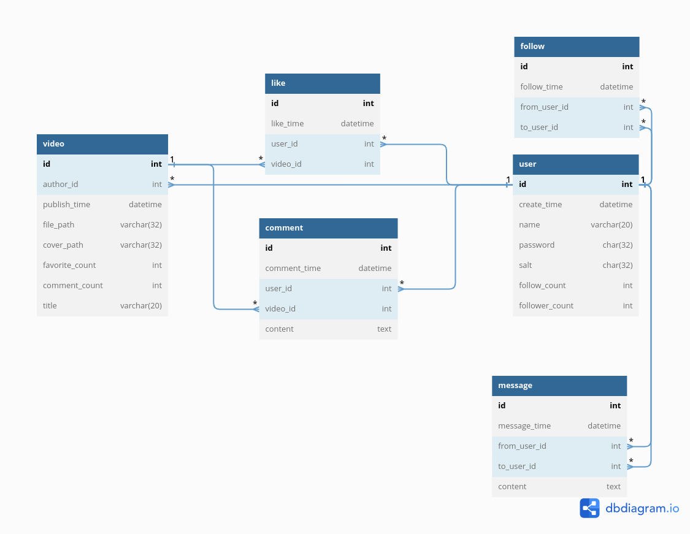

# TikDuck 一个极简版抖音的后端

## 项目工具依赖

- [Go 1.19](https://go.dev/)
- [go-task](https://taskfile.dev/installation/)，使用 `task` 查看所有的构建目标。（部分 linux 发行版安装完成之后的命令是 `go-task`）
- [golangci-lint](https://golangci-lint.run/)，使用 `task lint` 运行 linter。
- [mockery](https://github.com/vektra/mockery) 生成 mock
- [kitex](https://www.cloudwego.io/docs/kitex/) 通过 IDL 生成 RPC 代码框架

## 调用关系

> 当前为第一版，接口说明请参考飞书内部文档
> 值得注意的是，尽管中文我们称他们为基础接口、互动接口、社交接口
> 但是我们将他们分别表述为user, user_platform, user_user



## 目录结构

```
.
├── docker-compose.yaml     // 用于创建 mysql 和 Etcd 的 docker-compose
├── go.mod
├── IDLs                    // 存放 IDL 文件
├── README.md               // 本文档
├── Taskfile.yaml           // 自动命令
├── user                    // 基础接口
├── user_platform           // 互动接口
├── user_user               // 社交接口
└── util                    // 通用工具函数
```

## 数据图关系图

> 初始化 sql 语句在 `/util/initsql` 下

